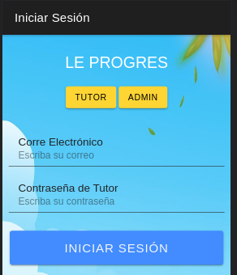
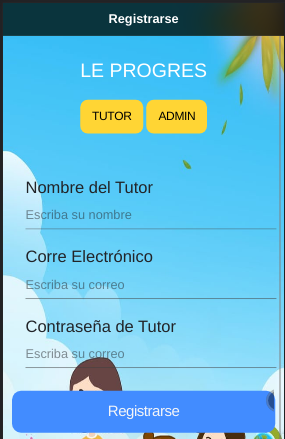
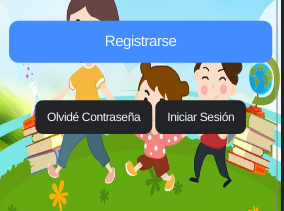
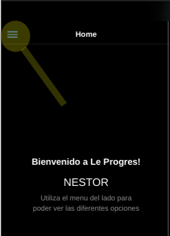

# FAQ o preguntas frecuentes

## General

- **Q: ¿Cómo inicio sesión?**
    - R: Para poder iniciar sesión tenemos que haber creado una cuenta previamente, luego de tenerla, digitaremos nuestro usuario, y la contraseña. 
- **Q: ¿Cómo me puedo registrar?**
    - R: Al momento de iniciar la aplicación se presentará con la página de registrarse, solamente se le pedirán un correo válido, su nombre y una contraseña. Una vez ingresados esos datos, y luego de la validación, se le redirigirá hacia la página de inicio de sesión en donde usted tendrá que ingresar los datos previamente registrados.     
- **Q: No recuerdo mi contraseña**
    -  Al iniciar la aplicación, se puede observar en la parte inferior de la pantalla, un botón con la opción de "**Olvidé Contraseña**"  
- **Q: Estoy en la página de inicio ¿Ahora qué?**
    -  En la parte superir izquierda o haciendo un swipe a la derecha, se mostrará un menu con las diferentes secciones que tiene la aplicación. 
- **Q: ¿Puedo cambiar los colores de la página de inicio?**
    - Para poder cambiar el color de fondo de la aplicación es necesario cambiar el tema por defecto del dispositivo en el que se usa. Consulte la documentación de dispositivo para cambiar el tema Claro y Oscuro y la aplicación se sincronizará con dicho tema.
